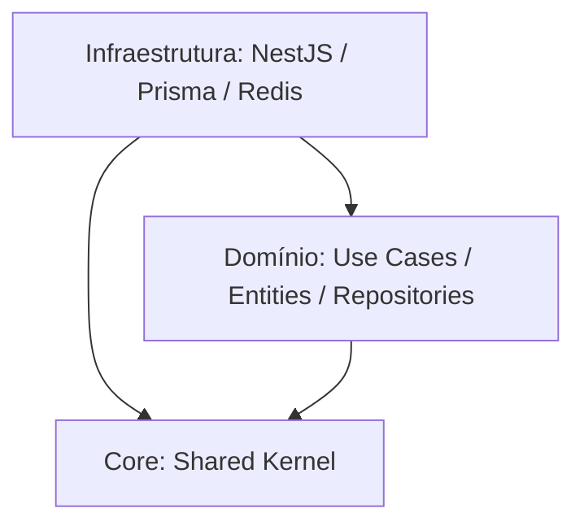

# NestJS + Domain-Driven Design (DDD) & Clean Architecture 🚀

Este repositório contém o backend de um fórum de perguntas e respostas robusto, resiliente e escalável. A aplicação foi construída com **NestJS**, **Prisma** (Postgres), **Redis** (Cache) e **Vitest**, seguindo os rigorosos princípios de **Clean Architecture** (Arquitetura Limpa) e **Domain-Driven Design (DDD)**.

O principal objetivo dessa arquitetura é **isolar completamente a lógica de negócio do domínio** de quaisquer detalhes de implementação tecnológica (bancos de dados, frameworks, servidores web ou serviços de terceiros).

---

## 🗺️ Arquitetura das Camadas (Layered Architecture)

A estrutura do projeto está dividida em três camadas principais dentro do diretório `src`:

```
src/
├── core/       # Kernel Compartilhado (Shared Kernel)
├── domain/     # Camada de Domínio Pura (Regras de Negócio de Alto Nível)
└── infra/      # Camada de Infraestrutura (NestJS, ORM, HTTP, Cache, Adaptadores)
```

### 📊 Fluxo de Dependência

A regra fundamental desta arquitetura é a **Direção das Dependências**: *as camadas externas podem depender das internas, mas as camadas internas nunca podem depender de nada que esteja fora delas.*



| Camada | Propósito / Responsabilidades | Depende de quem? |
| :--- | :--- | :--- |
| **Core** | Contém classes abstratas, tipos e utilitários compartilhados que são transversais a toda a aplicação (`Entity`, `UniqueEntityID`, `Either` para tratamento de erros funcionais, `DomainEvents`). | Ninguém |
| **Domain** | O coração do software. Contém entidades de negócio, regras corporativas imutáveis, casos de uso da aplicação e as interfaces abstratas de repositório. Livre de qualquer dependência a NestJS ou Prisma. | `core` |
| **Infra** | Contém o framework NestJS, o ORM Prisma, servidores HTTP, middlewares, adaptadores de autenticação (JWT), upload de arquivos (S3), banco de dados Postgres e o repositório de cache Redis. | `domain` e `core` |

---

## 🏛️ Camada de Domínio (`domain`): Regras de Negócio Puras

A camada de domínio é dividida em subdomínios (Contextos Delimitados ou *Bounded Contexts*):
* `forum`: Responsável por discussões, respostas, comentários e anexos.
* `notification`: Responsável pela entrega, leitura e histórico de notificações.

Cada subdomínio divide-se em:
1. **`enterprise`**: Regras corporativas cruciais que se aplicam mesmo sem um sistema de software (Entidades, Agregados, Objetos de Valor).
2. **`application`**: Casos de uso específicos da aplicação e interfaces de repositórios (Contratos de persistência).

### 🔑 Conceitos Chave de Domínio no Código

#### 1. Entidades vs. Objetos de Valor (Value Objects)
* **Entidades (`Entity`)**: Classes que possuem ciclo de vida e identidade persistente única e contínua, mesmo que todos os seus atributos mudem.
  * *Exemplo*: `Student`, `Instructor`, `Question`.
  * Herdam de [entity.ts](src/core/entities/entity.ts) e utilizam [unique-entity-id.ts](src/core/entities/unique-entity-id.ts).
* **Objetos de Valor (`Value Object`)**: Objetos imutáveis que não têm identidade e são definidos apenas pela igualdade de suas propriedades.
  * *Exemplo*: [slug.ts](src/domain/forum/enterprise/entities/value-objects/slug.ts). Duas slugs com o mesmo texto são consideradas o mesmo valor.
  * Herdam de [value-object.ts](src/core/entities/value-object.ts).

#### 2. Agregados e Raízes de Agregação (Aggregates & Aggregate Roots)
Um **Agregado** é um agrupamento de entidades e objetos de valor que são modificados como uma única transação e mantêm sua integridade juntos. A **Raiz de Agregação** (`AggregateRoot`) é a única entidade do grupo pela qual o mundo externo pode interagir.

* *Exemplo*: A entidade **[question.ts](src/domain/forum/enterprise/entities/question.ts)** é uma raiz de agregação que gerencia a lista observada de anexos (`QuestionAttachmentList`). Ninguém fora da classe `Question` pode modificar os anexos diretamente; todas as adições e remoções são intermediadas pelas regras de negócio da própria Pergunta.
* Herda de [aggregate-root.ts](src/core/entities/aggregate-root.ts).

#### 3. Watched List (Coleções Observadas)
Utilizado para resolver eficientemente atualizações de coleções nos relacionamentos de banco de dados no Prisma. A classe **[watched-list.ts](src/core/entities/watched-list.ts)** monitora quais registros filhas foram adicionados ou removidos da raiz do agregado em memória durante o ciclo de vida da requisição.
* *Benefício*: Ao persistir, o repositório da infraestrutura chama apenas `createMany` para os novos itens e `deleteMany` para os removidos, evitando apagar e reinserir todos os anexos repetidamente no banco.

#### 4. Tratamento de Erros Funcional (`Either` Monad)
Evita o lançamento excessivo de exceções e `try/catch` para erros normais do fluxo de negócio (permissão negada, recurso inexistente). O arquivo [either.ts](src/core/either.ts) tipa a resposta de forma binária:
* **`Left`**: Representa falha/erro de negócio esperado (ex: `NotAllowedError`).
* **`Right`**: Representa sucesso (ex: `{ question: Question }`).
* *Uso nos Casos de Uso:*
  ```typescript
  type CreateQuestionUseCaseResponse = Either<NotAllowedError, { question: Question }>
  ```

---

## ⚡ Eventos de Domínio (Domain Events)

O sistema utiliza eventos para notificar outros subdomínios de alterações ocorridas, de maneira totalmente assíncrona e desacoplada.

```
[Entidade do Aggregate] -(Registra Evento em Memória)-> [AggregateRoot]
                                                               │
[Repositório Concreto]  -(Persiste no DB & Dispara Eventos) ───┘
                                                               │
                                                       [DomainEvents]
                                                               │ (Notifica)
                                                               ▼
                                                      [Ouvintes/Subscribers]
                                                   (ex: OnAnswerCreated)
```

1. **Registro**: Ao responder uma pergunta, a classe `Answer` registra o evento:
   ```typescript
   this.addDomainEvent(new AnswerCreatedEvent(this))
   ```
2. **Persistência**: Quando a resposta é salva pelo repositório (`PrismaAnswersRepository.create`), o banco de dados é atualizado e em seguida é disparado:
   ```typescript
   DomainEvents.dispatchEventsForAggregate(answer.id)
   ```
3. **Reação**: O ouvinte assíncrono **[on-answer-created.ts](src/domain/notification/application/subscribers/on-answer-created.ts)** captura o evento de criação e chama o caso de uso de notificações (`SendNotificationUseCase`) para notificar o autor da pergunta correspondente.

---

## 🛠️ Camada de Infraestrutura (`infra`): Framework e Detalhes Técnicos

A infraestrutura hospeda todas as tecnologias e bibliotecas necessárias para rodar a aplicação, totalmente desacoplada das regras de negócio puras.

### 🛡️ Módulos e Funcionalidades do NestJS

O NestJS coordena as injeções de dependência e expõe os endpoints HTTP organizados em módulos estruturados:

* **[app.module.ts](src/infra/app.module.ts)**: Configuração principal que importa os módulos HTTP, Banco de dados, Criptografia, Variáveis de Ambiente e Eventos.
* **[http.module.ts](src/infra/http/http.module.ts)**:
  * **Controllers**: Recebem a requisição HTTP, validam o payload de entrada usando Pipes baseados em **Zod** (`ZodValidationPipe`), chamam o Use Case do Domínio e retornam os dados.
  * **Presenters**: Classes como [question-details-presenter.ts](src/infra/http/presents/question-details-presenter.ts) responsáveis por formatar e mapear a entidade de domínio pura em um formato de resposta JSON ideal para o cliente HTTP.
* **[database.module.ts](src/infra/database/database.module.ts)**:
  * **PrismaService**: Instanciação da conexão do cliente Postgres.
  * **Inversão de Dependência (DIP)**: Mapeia tokens abstratos de repositório do domínio para suas implementações concretas do Prisma.
    * *Exemplo*:
      ```typescript
      {
        provide: QuestionsRepository,
        useClass: PrismaQuestionsRepository,
      }
      ```
  * **Mappers**: Classes de conversão bidirecional (ex: `PrismaQuestionMapper`) que transformam os modelos gerados pelo Prisma nas entidades de domínio e vice-versa.
* **[auth.module.ts](src/infra/auth/auth.module.ts)**: Controla a segurança utilizando estratégias de autenticação JWT assinadas com chaves públicas e privadas RSA baseadas em chaves assimétricas de segurança (`private_key.pem` e `public_key.pem`).
* **[cryptography.module.ts](src/infra/cryptography/crytography.module.ts)**: Implementações de criptografia de domínio (como hash de senhas e geração de tokens).
* **[env.module.ts](src/infra/env/env.module.ts)**: Valida e provê variáveis de ambiente usando Zod no arquivo de configuração global.
* **[storage.module.ts](src/infra/storage/storage.module.ts)**: Lida com uploads físicos de arquivos conectando-se ao AWS S3 ou ambientes similares.

---

## ⚡ Camada de Caching com Redis 💨

Para otimizar o tempo de resposta e poupar chamadas repetidas ao PostgreSQL em consultas complexas ou muito acessadas, o projeto implementou uma camada de **Caching baseada em Redis**.

O módulo está localizado em [src/infra/cache](src/infra/cache):
* **[redis.service.ts](src/infra/cache/redis/redis.service.ts)**: Conexão estendendo o cliente `ioredis`, com suporte a ganchos de ciclo de vida do NestJS (`OnModuleDestroy`) para encerramento limpo da conexão ao encerrar a aplicação.
* **[redis-cache-repository.ts](src/infra/cache/redis/redis-cache-repository.ts)**: Implementação concreta da interface `CacheRepository` configurando chaves com tempo de expiração padrão (TTL de 15 minutos).

### 🚀 Padrão de Cache Utilizado (Cache-Aside / Invalidação)

Essa otimização foi acoplada ao repositório de banco de dados [prisma-questions-repository.ts](src/infra/database/prisma/repositories/prisma-questions-repository.ts):

* **Cache Hit & Miss (`findBySlugWithDetails`)**:
  Ao buscar os detalhes de uma pergunta por sua slug, o repositório primeiro busca a chave correspondente no Redis:
  ```typescript
  const cacheHit = await this.cacheRepository.get(`questions:${slug}:details`)
  ```
  * *Cache Hit*: Se houver correspondência, converte os dados JSON guardados de volta para a entidade de domínio (`PrismaQuestionDetailsMapper.toDomain(cacheData)`) e retorna de imediato.
  * *Cache Miss*: Se não houver, executa a query complexa no Postgres via Prisma, guarda o resultado em string JSON no Redis para acessos futuros e retorna a entidade.

* **Invalidação de Cache (`save`)**:
  Sempre que uma pergunta é modificada/salva, o cache correspondente a essa slug específica é deletado de imediato no Redis para evitar inconsistências nos dados exibidos ao usuário:
  ```typescript
  await this.cacheRepository.delete(`questions:${data.slug}:details`)
  ```

---

## 🧪 Estratégia de Testes

O projeto adota duas suites principais de testes automatizados com o **Vitest**:

1. **Testes Unitários (`npm run test`)**:
   * Testam isoladamente os Casos de Uso do Domínio e Entidades.
   * Utilizam repositórios mockados em memória extremamente velozes (ex: `InMemoryQuestionsRepository`), garantindo que a suíte execute em poucos segundos.
2. **Testes E2E - End-to-End (`npm run test:e2e`)**:
   * Validam a integração ponta a ponta desde a chamada HTTP, passagem pelos guards, persistência real no PostgreSQL e cache no Redis.
   * Criam e removem esquemas de banco de dados Postgres únicos para cada suíte de forma assíncrona, assegurando o isolamento completo de concorrência.

### 💻 Comandos Rápidos

```bash
# Rodar todos os testes unitários
npm run test

# Rodar todos os testes end-to-end
npm run test:e2e

# Executar a aplicação local em modo de desenvolvimento (Watch)
npm run start:dev
```
